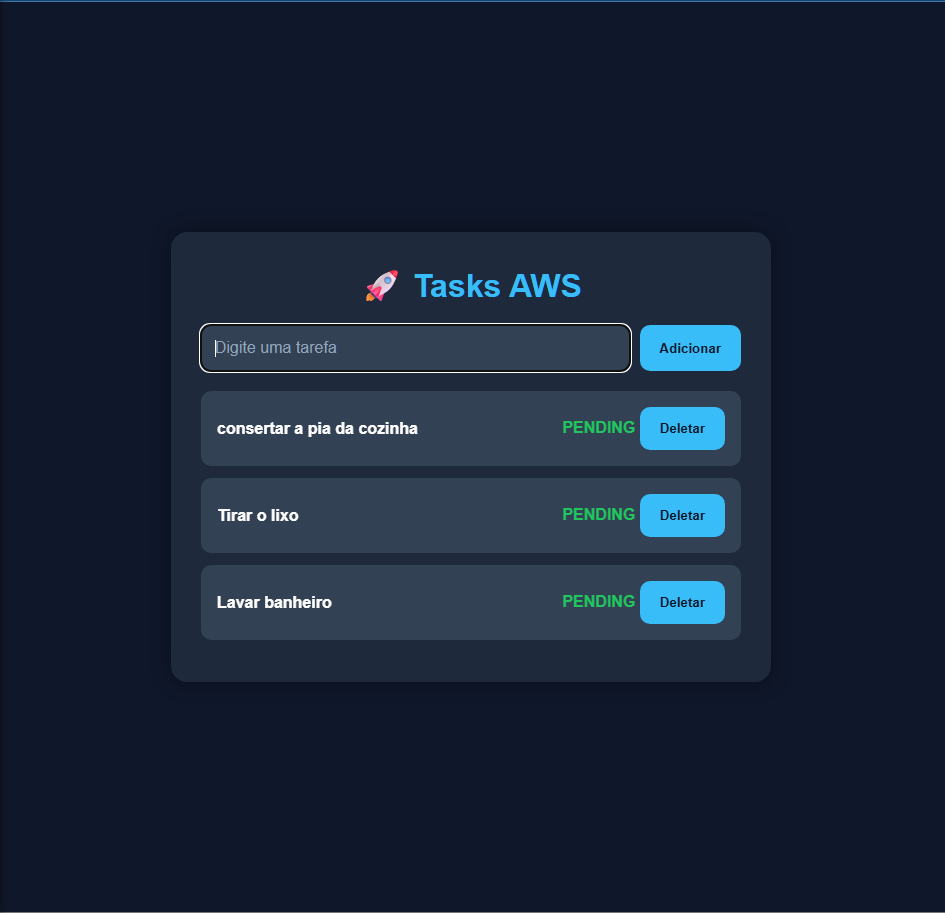
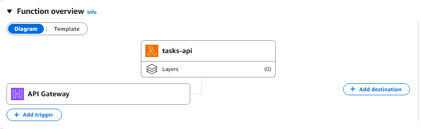
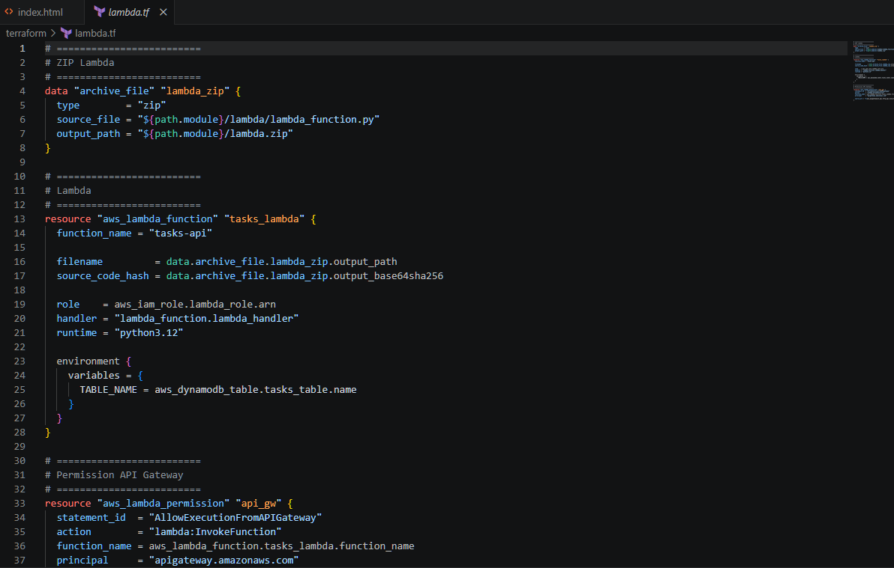
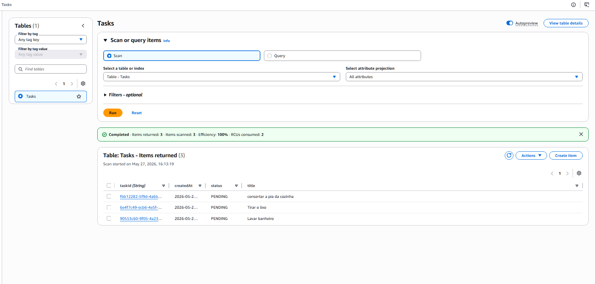

# 🚀 AWS Serverless Task Manager

Aplicação serverless desenvolvida na AWS com foco em prática de arquitetura cloud moderna, Infrastructure as Code (IaC) e preparação para a certificação AWS Developer Associate.

---

# 📌 Arquitetura da aplicação

```text
Frontend (HTML/CSS/JavaScript)
        ↓
Amazon S3 Static Website
        ↓
Amazon API Gateway
        ↓
AWS Lambda
        ↓
Amazon DynamoDB
```

---

# 🧠 Sobre o projeto

Este projeto consiste em uma aplicação de gerenciamento de tarefas desenvolvida utilizando arquitetura serverless na AWS.

A aplicação permite:

- Criar tarefas
- Listar tarefas
- Deletar tarefas

Toda a infraestrutura foi provisionada utilizando Terraform.

---

# ⚙️ Tecnologias utilizadas

## ☁️ AWS
- AWS Lambda
- Amazon API Gateway
- Amazon DynamoDB
- Amazon S3
- AWS IAM
- Amazon CloudWatch

## 🏗️ Infrastructure as Code
- Terraform

## 💻 Frontend
- HTML
- CSS
- JavaScript

---

# 🔥 Funcionalidades implementadas

- [x] Criação de tarefas
- [x] Listagem de tarefas
- [x] Exclusão de tarefas
- [x] Frontend integrado com API
- [x] Deploy do frontend no Amazon S3
- [x] API Serverless com AWS Lambda
- [x] Persistência de dados com DynamoDB
- [x] Provisionamento com Terraform
- [x] Configuração de CORS

---

# 📖 Fluxo da aplicação

```text
Usuário cria tarefa no Frontend
↓
Frontend envia requisição HTTP
↓
API Gateway recebe request
↓
Lambda processa a lógica
↓
DynamoDB salva os dados
↓
Resposta retorna para o Frontend
```

---

# 📂 Estrutura do projeto

```text
.
├── frontend/
│   └── index.html
│
├── lambda/
│   └── lambda_function.py
│
├── api_gateway.tf
├── dynamodb.tf
├── iam.tf
├── lambda.tf
├── outputs.tf
├── backend.tf
└── README.md
```

---

# 🖼️ Demonstração da aplicação

## 📌 Frontend da aplicação



---

## ☁️ Arquitetura AWS Lambda + API Gateway



---

## 🏗️ Provisionamento da infraestrutura com Terraform



---

## 🗄️ Dados persistidos no DynamoDB



---

# 🚀 Como executar o projeto

## 1️⃣ Clonar repositório

```bash
git clone https://github.com/AirtonSGuedes/aws-serverless-task-manager.git
```

---

## 2️⃣ Inicializar Terraform

```bash
terraform init
```

---

## 3️⃣ Provisionar infraestrutura

```bash
terraform apply
```

---

## 4️⃣ Realizar deploy do frontend no S3

Suba o arquivo `index.html` para o bucket S3 configurado.

---

# 🎯 Objetivo do projeto

Projeto desenvolvido para aprofundar conhecimentos em:

- Arquitetura Serverless
- Serviços AWS
- APIs HTTP
- Terraform
- Infrastructure as Code
- Integração entre serviços cloud
- Backend serverless moderno

---

# 📚 Conceitos praticados

- API Gateway Routes
- Lambda Functions
- DynamoDB CRUD
- HTTP Methods
- CORS
- JSON
- Deploy Cloud
- Frontend consumindo API
- Infrastructure as Code
- Serverless Architecture

---

# 🔗 Repositório

👉 https://github.com/AirtonSGuedes/aws-serverless-task-manager

---

# 👨‍💻 Autor

Airton Guedes

- GitHub: https://github.com/AirtonSGuedes
- LinkedIn: www.linkedin.com/in/airtonguedes0902
